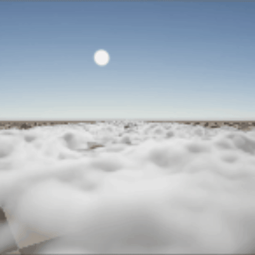

# Fish Game / Volumetric clouds

> [!IMPORTANT]
> For this ship I have only included volumetric clouds since I need gold for flight grants and a ticket to Macondo <3. I am unsure if there will be a game or if the project will be fully rebranded to volumetric clouds, but for this ship imagine that it's just volumetric clouds.

## How it works!
By sending a ray from the camera out towards the direction you're looking and sampling density at multiple points, a cloud can be formed! 

More in depth, for every pixel on the screen a ray is sent out in a shader. It takes small steps and samples noise textures to know how dense it is in that point. By sending out a second ray march towards the light source we can get shadows as well. 

These noise textures are generated by me following a structure described in Andrew Schneiders talk at SIGGRAPH 2015 (The Real-Time Volumetric Cloudscapes of Horizon: Zero Dawn  ([SIGGRAPH 2015 Course - Advances in Real-time Rendering in Games)](https://www.guerrilla-games.com/read/the-real-time-volumetric-cloudscapes-of-horizon-zero-dawn))

It also has support for cloud types which takes in a start altitude, height, density curve, and coverage curve. The values for the noise and cloud types are Classes which makes it easy to add new ones. 

## Difficulties

The biggest difficulty in this project was getting the clouds to have the right shape. It took many hours of experimenting with noise following different tutorials until I finally got decent shapes. Even after all this time I am not completely happy with it and will continue experimenting to make sure it looks exactly how I want it to look.

## Featureset

- [x] Simple customizability
- [x] Support for multiple cloud types
- [x] Light effects from the sun
- [x] Cloud shadows from an extra shadow raymarch
- [x] Ground shadows ( Plans to add cascades as the shadows only cover a small area around the player in high quality or large are with low quality)
- [x] Weather map: Currently only decides the coverage of the clouds but in the future will also decide the precipitation and cloud type.
- [ ] Temporal Upscaling / reprojection. Already exists but is currently broken >:( and since I don't know what's wrong with it I don't want to spend time maybe figuring it out.
- [ ] Automatic addition of cloud types. I want to make it possible to add cloud types just by adding another CloudType class. Even during runtime.
- [ ] TOD effect. Different sun / ambient colors depending on the time of day. Right now the sun decides how the shadows are pointed and the color values are decided in the inspector.

## Credits
I want to give credits to Andrew Schneider who made the volumetric clouds for the Horizon game series. His published work helped a lot in the making of this project.
I also want to give credit to Blackrack who made the volumetric clouds mode for Kerbal space program and made the volumetric clouds in Kitten Space Agency. I took inspiration from his debug view when adding cloud types by adding curves, which made modeling cloud types a lot easier.
Lastly I want to give credit to Technically Harry on YouTube for making me interested in volumetric rendering with his video ([Your first volumetric fog Shader | Unity URP)](https://www.youtube.com/watch?v=8P338C9vYEE).
